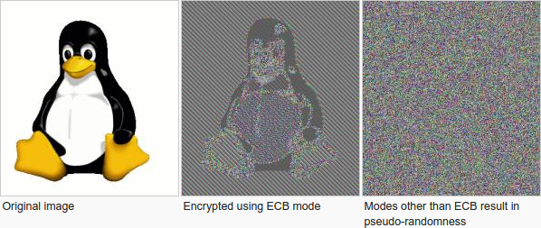

# AES-ABC (AES-ECB)

So someone tried a lazy way of chaining AES-ECB so that the bytes pattern are not easy to see. We try to crack it.

## The Question

"Crack" the AES-ABC encrypted **image** without key. (We don't even know the keysize - so we don't even know which of the AES-128/196/256)

AES-ABC is like this:

```text
All AES-ECB box has the same key, keys are not drawn.

Block 0      Block 1      Block 2

   IV          PT           PT
   |            |            |
   |            V            V
   |         -------      -------
   |         | AES |      | AES |
   |         -------      -------
   |            |            |
   V    Add     V    Add     V
   IV   ->      CT    ->     CT

PT stands for plaintext
CT stands for ciphertext
IV generated by random. Normally should also be given when needs to be decrypted.
They all are 16 bytes (128 bits)

Add operation needs to mod 2^128. Just make sure it fits a block as a 128 bit integer.

block[i] = AES(key, plaintext[i]), same key for all blocks
final_block[i] = final_block[i-1] + block[i]
final_block[0] = IV

The ciphertext is all the final_blocks.
```

## Solve the problem

We have no way to get the **key**. We are not even going to crack the ECB part.

The only thing we can do is to reduce "AES-ABC" back to "AES-ECB".

Modulo-addition can easily be reversed.

```text
final_block[i] = a
final_block[i-1] = c
block[i] = b

a+b ≡ c mod n
b ≡ (c-a) mod n

In Python, c-a mod n works well even c-a is negative
(c-a)%n
```

We have the IV (`final_block[0]`) and `final_block[1]`. So we know `block[1]`.

We know `final_block[1]` and `final_block[2]` so we know `block[2]`...

And we know all the blocks.

Check the python scripts if interested.

- `aes-abc.py` is the original AES-ABC encryption script with my comments
- `crack-AES-ABC.py` is the attacking script in Python 2
- `crack-AES-ABC_py3.py` is the attacking script in Python 3

The biggest trap is **DO NOT OVERWRITE block[i]** - use a new list to hold the ECB blocks. (This is about being careful more than knowing the cryptograhy details)

Output of the picture in ECB mode(without IV).

``` bash
# $ sha256sum body.enc_ecb.ppm
# abedb0bdac9a5de8ed50feaec0804a5e6ec80c5b476b05959d7b5302745e33c9  body.enc_ecb.ppm
```

## Recall the problem of ECB

In this `ppm` setup, we use 3 bytes to represent 1 pixel. One AES block contains about 5 pixels.

This lazy AES-ABC tries to hide the AES-ECB weakness but obviously failed. (And we should really appreciate CBC)

There are so many repeating patterns in outer area of the picture. The same key and same plaintext would yield same output. Our eyes can see through the patterns.

In some setup (like message is very short) using ECB may not be that bad... but should still be avoided.

The whole idea is we really should not reuse the same key and same plaintext. The AES encrypt blackbox at the deepest level is like this. `AES_encrypt(plain_16_bytes, key_16_bytes)`

The modes of operations helps to change `plainbytes` or `keybytes` in different ways.

## Lessons learnt

Basically this famous Linux penguin picture.


